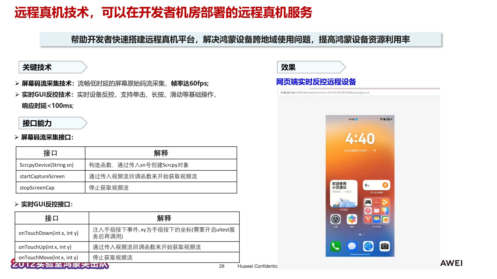
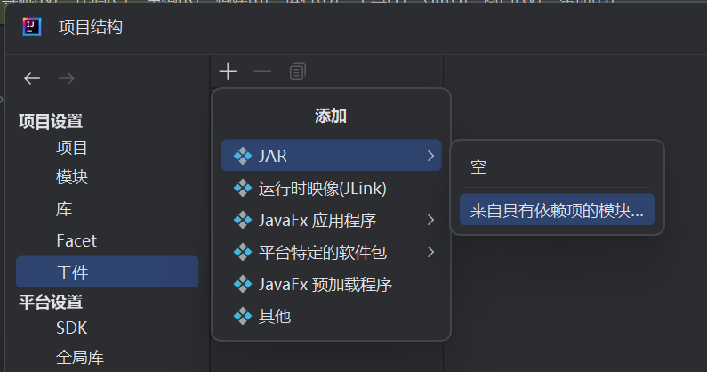
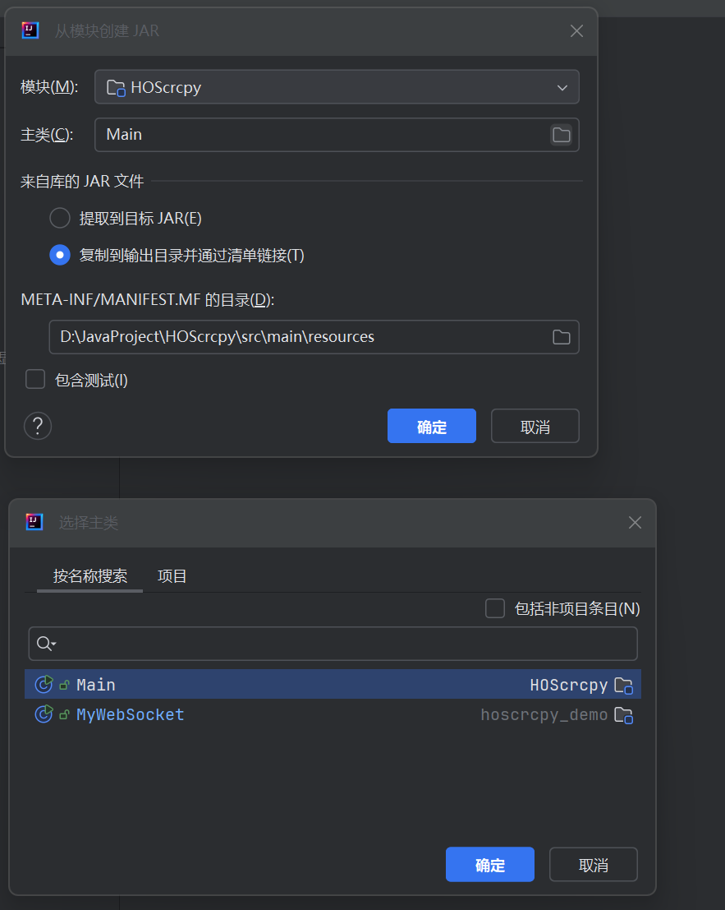
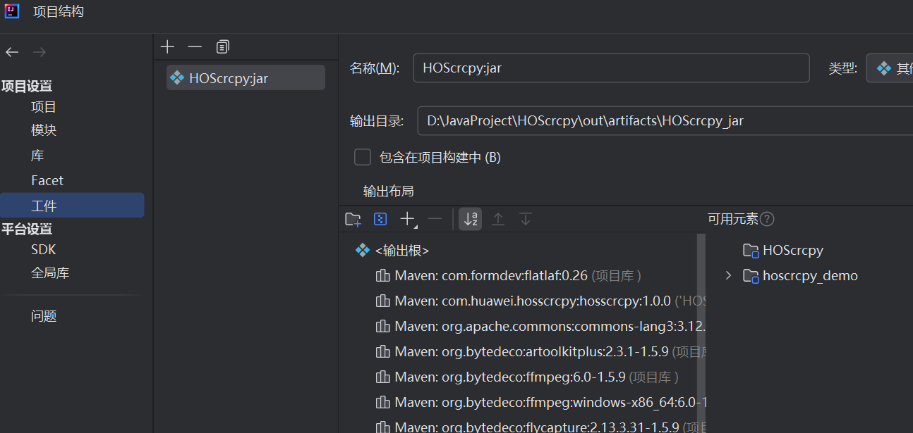
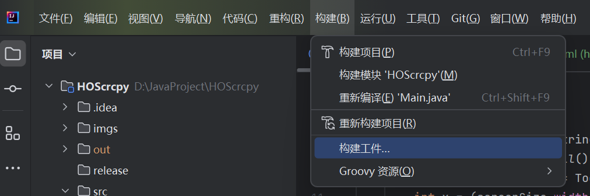
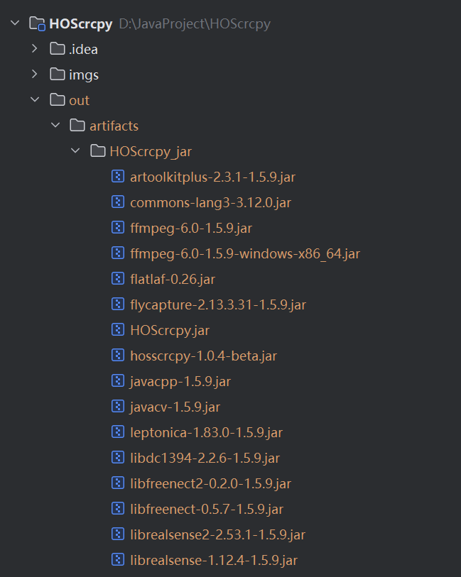
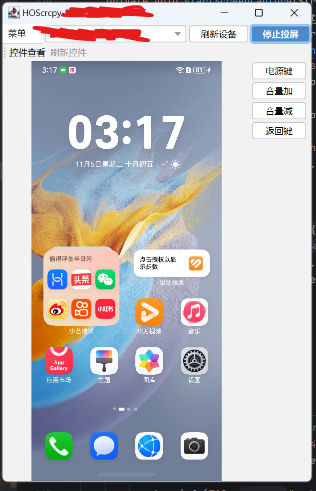

# 鸿蒙远程真机工具

## 工具介绍
该工具主要提供鸿蒙系统下基于视频流的投屏功能，帧率基本持平真机帧率，达到远程真机的效果。



## SDK使用指南
利用hoscrcpy API开发者可以实现HarmonyOS NEXT设备投屏工具、远程真机平台等能力；

hoscrcpy API介绍：https://gitcode.com/OpenHarmonyToolkitsPlaza/HOScrcpy/blob/main/hoscrcpy%20API%E4%BB%8B%E7%BB%8D.md

## 工程说明

本工程提供一个本地化基于视频流方案HarmonyOS NEXT设备的投屏工具，支持设备投屏、控件元素查看、导入与导出。

```
.
|-- src
|   |-- main
|       |--java
|          |--forms              
|          |--utils
|          |--Main.java                       // 投屏工具启动主类
|   `   |-- resources
|          |--libs
|             |--hosscrcpy-1.0.4-beta.jar     //需要在发行版中下载
|--release
|   |--win_start.bat                          // 编译生成后windows上的启动命令
|   |--mac_start.sh                           // 编译生成后MAC上的启动命令
|--web_demo                                   //介绍SDK在HTML上的使用，具体目录参考Web_Demo示例说明
|-- README.md
```

### 编译步骤

#### windows平台编译

1.添加工件



2.设置工件配置



3.完成设置



4.构建工件



5.构建完成后的产物会存放在当前项目的out文件夹下，HOScrcpy_jar文件夹下的所有jar在使用时将会用到



#### mac平台编译

步骤与windows平台相同

只是需要更换pom文件中的一个依赖

将下面的依赖

```
 <dependency>
            <groupId>org.bytedeco</groupId>
            <artifactId>ffmpeg</artifactId>
            <version>6.0-1.5.9</version>
            <classifier>windows-x86_64</classifier>
 </dependency>
```

修改为

```
<dependency>
            <groupId>org.bytedeco</groupId>
            <artifactId>ffmpeg</artifactId>
            <version>6.0-1.5.9</version>
            <classifier>macosx-x86_64</classifier>
 </dependency>
```


### 使用方法

**使用前需要保证在系统环境变量中配置JAVA_HOME环境变量(JAVA_HOME环境变量不需要包含bin目录)**

在构建出的工件jar包存放路径下，执行cmd命令 `"java -jar HOScrcpy.jar -cp Main "`

命令执行后将会出现如下界面，刷新出设备后点击"进入投屏按钮",稍等片刻，即会出现投屏画面



## Web_Demo示例说明

根目录下web_demo提文件供为一个以maven构建的在html上显示进行鸿蒙设备投屏的demo工程实例。

其中需要在发行版中下载对应的v1.0.4-beta的jar包并放置在src/resources/libs文件夹下，目录结构如下：
```
./web_demo/src
|-- main
|   |-- java
|   |   `-- MyWebSocket.java
|   `-- resources
|       |-- html
|       |   |-- h264.html
|       |   `-- jmuxer.min.js
|       |-- libs
|       |   `-- hosscrcpy-1.0.4-beta.jar     //需要在发行版中下载

```

demo原理：通过在本地创建一个WebSocket服务端启动投屏服务，然后在网页端进行投屏的查看以及控制

使用方法：

1.执行MyWebSocket下的main方法，以此启动WebScoket服务

2.修改resources/html下的h264.html的第31行，填写自己本地设备的sn号

3.用浏览器打开h264.html，稍等片刻即可看到投屏画面
PS：静止画面下不会自动刷新，可以滑动下手机看看

## 获取途径
如需获取最新版请联系 liguangjie1@huawei.com, litiance@huawei.com, guoxuanda@huawei.com